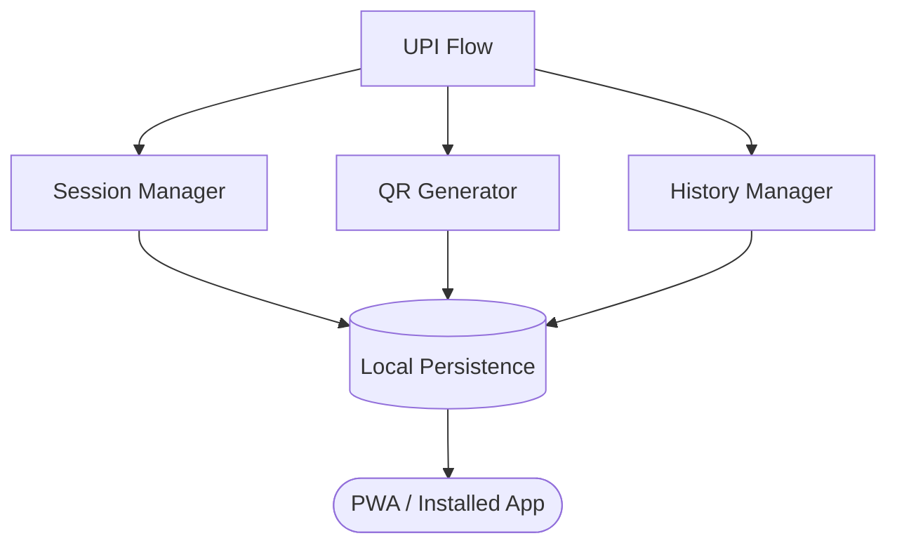

  
  <h1>UPI Flow</h1>
  
<strong>A lightning-fast, offline-first Progressive Web App for smart UPI payment management.</strong>

  

    <a href="https://sumitrawat2417.github.io/upi-flow-public/"><b>🚀 Launch Live App</b></a>
  

  

    
    
    
    
    
  

| Home / Amount | Confirm Split | Session Complete |
|:---:|:---:|:---:|
|  |  |  |

---

> ⚠️ **Repository Notice**  
> **This is a public-facing repository used exclusively for deploying the compiled application.**  
> The source code and intellectual property for **UPI Flow** are maintained in a separate private repository. For inquiries regarding the source code or commercial licensing, please contact the author.

---

## 📖 What Is UPI Flow?

**UPI Flow** is a sleek, privacy-first merchant utility built on a **serverless, client-side architecture** — all logic, storage, and QR generation happen entirely on the merchant's device, with no dependency on external servers or accounts.

Built in response to the UPI merchant pricing framework (September 2026), UPI Flow helps merchants split large payment totals into smaller sequential amounts — each with its own QR code — and guides them through a clean, counter-style confirmation workflow.

> UPI Flow is a **QR code generator and payment session manager**. It does not process, hold, or transfer any funds. All money flows directly through the merchant's normal UPI bank infrastructure.

---

## ✨ Features

### Core Workflow
- 🏪 **Merchant Onboarding** — Set up your business name and UPI ID in under 30 seconds. Scan an existing UPI QR to auto-fill your ID.
- ⚡ **Smart Split Engine** — Enter any amount. UPI Flow instantly calculates the optimal split (e.g., ₹5,500 → ₹2,000 + ₹2,000 + ₹1,500).
- 🎯 **Custom Split** — Override the auto split and enter your own amounts. The app validates they add up correctly.
- 📲 **Sequential Payment Sessions** — One QR at a time. Merchant taps "Mark Received" after confirming in their UPI app, and the next QR appears automatically.
- 📜 **Local History** — Every session is saved to the device. Review past sessions, see individual QR breakdowns, and delete when needed.

### UPI ID Management
- ➕ **Multiple UPI IDs** — Add, label, and manage multiple UPI IDs (e.g., GPay, PhonePe, Bank) under a single profile.
- 🔄 **Round-Robin Mode** — Optionally rotate QRs across all your UPI IDs automatically within a session.
- 📷 **QR Scan to Add** — Scan an existing UPI QR with the camera or upload an image to extract and add a UPI ID instantly.

### App Experience
- 🌗 **Theme Engine** — Light, Dark, or System (auto-follows device setting, updates in real-time).
- 📱 **Portrait-Only Design** — Optimized exclusively for mobile portrait use. Landscape mode shows a rotate prompt.
- 📲 **Install Banner** — Prompts the merchant to install to home screen on every fresh launch.
- ⚙️ **Configurable Threshold** — The ₹2,000 split threshold is adjustable in Settings. Future-proof against policy changes.

### Privacy & Data
- 🔒 **Privacy-First Architecture** — All data (profiles, sessions, history) lives entirely on the device. Serverless by design — no cloud, no accounts, no tracking.
- 📊 **Export to CSV** — Export full payment history with session-level and individual QR-level breakdowns for accounting.
- 🗑️ **Clear & Reset** — Clear history or reset all data with proper confirmation safeguards (type "RESET" to confirm).

### Legal & Compliance
- 📄 **In-App Legal Pages** — Privacy Policy (DPDPA 2023-aligned), Terms of Use, and Help & FAQ all built into the app.

---

## 📸 More Screenshots

| Onboarding | UPI Verified | Split Options |
|:---:|:---:|:---:|
|  |  |  |

| Payment History | Settings | How It Works |
|:---:|:---:|:---:|
|  |  |  |

---

## 🏗️ Architecture

**State & Data Model:**
The application operates entirely on the client side using a serverless model.
- **Session Manager:** Orchestrates the split payment workflow. It calculates remaining balances, handles the round-robin logic for multiple UPI IDs, and maintains the state of the active transaction until all chunks are marked as received.
- **QR Generator:** Dynamically creates zero-dependency SVG payloads embedding exact payment amounts and transaction IDs, ensuring merchants never manually type amounts.
- **Local Persistence:** All state—merchant profiles, UPI IDs, past sessions, and settings—is synced synchronously to local storage. No data ever leaves the device.

---

## 🛠️ Technology

| Layer | Technology | Why |
|-------|-----------|-----|
| UI Framework | React 19 + TypeScript | Component-based application UI with strict type safety |
| PWA | Vite PWA / Manifest | Installable and offline-capable mobile experience |
| Storage | Local persistence | Device-local transaction/session data without cloud dependency |
| QR | qrcode.react | Client-side UPI payment payload generation |
| State | React Context + Hooks | Session/payment workflow state management |
| Styling | Tailwind CSS v4 | Rapid design system implementation with tokens |
| Deployment | GitHub Pages | Static application delivery and hosting |

---

## 📱 How to Install

**Android (Chrome):**
1. Open the app link above
2. Tap the banner at the bottom, or use the browser's "Install App" menu
3. Tap "Add to Home Screen"

**iPhone (Safari):**
1. Open the app link in Safari
2. Tap the Share button → "Add to Home Screen"
3. Tap "Add"

Once installed, the app launches in full-screen portrait mode, just like a native app.

---

## 🔗 Links

- **Live App:** [https://sumitrawat2417.github.io/upi-flow-public/](https://sumitrawat2417.github.io/upi-flow-public/)
- **Organization:** [ManSula](https://mansula.netlify.app/) · [ManSula DivLabs](https://mansuladivlabs.netlify.app/)
- **Support:** sumitrawat2417@gmail.com

---

## ⚖️ License

**© 2026 Sumit Rawat (Forbit) / ManSula DivLabs. All rights reserved.**

This is a proprietary application. No license is granted to view, modify, distribute, or use the source code or assets. The compiled application is published here for demonstration and end-user access only.

---

  
<em>Built by Forbit (Sumit Rawat) · A ManSula DivLabs product</em>

  
Not affiliated with NPCI, any UPI operator, or bank.

